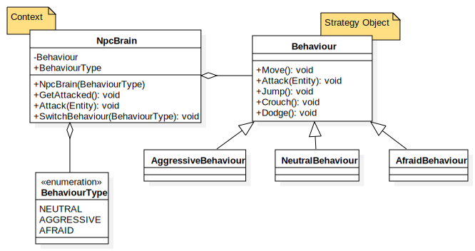

# Strategy Pattern

## Definition
### Official
Define a familly of algorithms, encapsulate each one, and make them interchangeable. It lets the algorithm vary independently from clients that use it.

### Simplified
A pattern that allow us to switch behaviors easily (like brains switch).

### Need more explanations? Click [here](https://www.geeksforgeeks.org/strategy-pattern-set-1/)

# The example
Let's say we will encounter different types of NPCs (friendly / enemies) in our game. These guys are going to be controlled by their own AI systems. We want to have 3 types of behaviors for these AIs. So far, nothing crazy. We could do three classes that have nothing to do with each other. Or maybe a little inheritance.
* **AggressiveBehaviour** : When NPCs want to attack the player

* **NeutralBehaviour** : When NPCs does its basical stuff

* **AfraidBehaviour** : When NPCs are afraid of the Player interaction (killing an other NPC in front of him... poor guy).

Now, we want these NPCs to be able to change their attitude according to the inputs they will receive in the game. Things are getting interesting here!

Now with those rules it would give us this UML :

Those classes inherit from a Base Class *Behaviour*. We can call it as the *Strategy Object*.

But, it's not done! It misses the **Context**. This is a class that maintain a reference to the *Strategy Object*.

With this final rule here the UML:

Theory is enough. Let's go to the code!